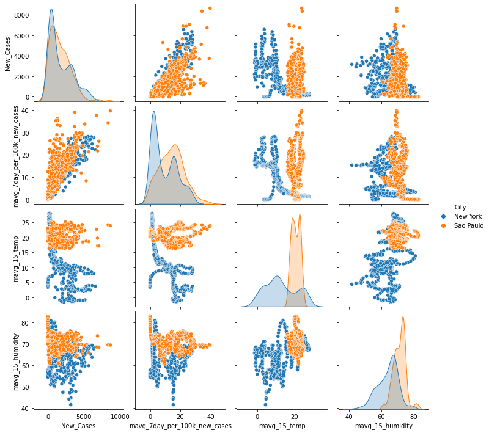

# Impact of climate variables on Covid 19 cases
## Introduction 

The new novel corona virus known as Covid19 (SARS CoV-2), has caused one of the most serious health crises globally. Since its global spread last year, we've seen multiple news article around the impact of temperature and humidity on the speed of spread and whetheer or not virus thrive in colder temerpatur.
A simple Google search using term "covid spread cold and dry weather news" will yelid multiple articles from credible news outlet and statiscal and scentfice websites in favor or against. 

Some of the key one published over the year are:
1.  www.cebm.net on Mar 23,2020 [Do weather conditions influence the transmission of the coronavirus (SARS-CoV-2)?](https://www.cebm.net/covid-19/do-weather-conditions-influence-the-transmission-of-the-coronavirus-sars-cov-2/)
2.  www.medicalnewstoday.com on Aug. 15,2010 [How does weather affect COVID-19?](https://www.medicalnewstoday.com/articles/how-does-weather-affect-covid-19)
3.  www.statenews.com on Oct. 21,2020 [Covid-19’s wintry mix](https://www.statnews.com/2020/10/21/covid19-winter-dry-indoor-air-helps-coronavirus-spread/)
4. www.sciencedaily.com on Nov. 2,2020 [Hot or cold, weather alone has no significant effect on COVID-19 spread](https://www.sciencedaily.com/releases/2020/11/201102155409.htm)
5.  www.cbc.ca on Nov. 7, 2020 [Winter will help COVID-19 spread more easily](https://www.cbc.ca/news/canada/manitoba/covid-19-winter-tips-1.5788154)
6. www.huffingtonpost.ca on Jan.7,2021 [Does Cold Weather Make COVID-19 Spread More Easily?](https://www.huffingtonpost.ca/entry/cold-weather-spread-covid-explainer_ca_5ff78146c5b612d958ea6d29)
7.  www.ctvnews.ca on Sep. 20,2020 [COVID-19 appears to spread less in warm and wet climates](https://www.statnews.com/2020/10/21/covid19-winter-dry-indoor-air-helps-coronavirus-spread/)

The first link is a study done at the beigning of 2020 by University of Oxford and its reuslt around this topic.

## Purpose

The purpose of this study is to analyse if colder and dryer weather increases the spredh of Covid-19 virus. More specificaly find the realtion and quatify the increase in spread with temperature drop of every x degree celsius or percipatation dropped by y%.

## Data

**Data Source:**  

1.  [Weather Data One time history bulk data for New York City and Sao Paulo City]( https://history.openweathermap.org/storage/fa037ddb81b7f7f0a0d1a0ebd131858e.csv)
2.  [New York daily Covid data from NYC Health](https://github.com/nychealth/coronavirus-data/blob/master/trends/data-by-day.csv)
3.  [Sao Paulo daily Covid data from SEADE ](https://raw.githubusercontent.com/seade-R/dados-covid-sp/master/data/dados_covid_sp.csv)

**Variables:** 
1.  Dependent: After data discovery , following variable was identified to measure the spread of Covid
    -   7day moving avg new cases per 100,000 population: mavg_7day_per_100k_new_cases
2.  Inependent Variables:After data discovery , following variables were identified to represent weather
    - Moving 15 day average of daily temperature  I,e from reported -14  to reported date -1: mavg_15_temp
    - Moving 15 day average of daily humdity I,e from reported -14 to reported date -1: mavg_15_humidity

**Scope of project:** The selected cities are New York, and Sao Paulo. Cities are selected based on similar population per 100,000, covid cases, weather differences covid response. 

## ETL: 

After data discovery phase, we identifed the data sources, transformation logic and target data output required for model and co-relation analysis.The details of the ETL can be found in [Jupyter Notebook to perform full refresh for target file Final_Combine_Data](01_ETL_FullRefresh.ipynb)

## Data Definition

1. Covid metrcis:
    -   Covid19 rate: Total number of Covid cases by 100k inhabitants reported in selected cities per capital population (New daily case / City Population) 
2.  Weather metrics: A combination of variables like daily Average Temperature,Average Humidity.
    -   Average daily temparture in celsius: daily_humidity
    -   Average daily humidity: daily_temp 
3. Final Combine Data dictionary

## Methodology

To analyse the impact of weather on Covid19 rate of new cases, we shall be doing hypothesis testing and try to find out whether factors like temperature, humidity and their averages have any relationship with the rate of Covid19 infections.

H0: Weather conditions such as average daily temperature, humidity, Moving 15 day average of daily temperature, Moving 15 day average of daily humdity have no effect on the rate of new Covid19 cases in 2 cities

H1: Weather conditions such as average daily temperature, humidity, Moving 15 day average of daily temperature, Moving 15 day average of daily humdity have effect on the rate of new Covid19 cases in 2 cities

To test our hypothesis, we shall be utilizing one or more of the following models: 
-  Correlation
-  Linear Regression Model

We are following the considerations below to complete the analysis:

- 15 days average temperature and humidity up to the day before  as this is usually the virus incubation period
- New cases per 100K to compare same size of population
- Moving 7 days average of new cases per 100K to smooth out any reporting anomalies 
- We ran correlations to validate the strength of the relationship between the variables. 
- We ran 3 different regressions , one for each city and one combined. For the combined, we added “is_New York flag” (1= NY, 0=SP)

**Assumptions:** For our modelling purpose we are taking into consideration following assumptions:
-   There are no extreme deviations in daily average weather parameters
-   Covid testing was available with similar opportunities to the residents of both cities
-   All or none Covid19 precautions were followed by residents of both of the cities 

## Data exploratory Analysis

### First round of data discovery:

- Started with 4 data sets 
1.  [Kaggle Weather Data]( https://www.kaggle.com/sudalairajkumar/daily-temperature-of-major-cities)
2.  [Major Cities Covid Data]( https://saludata.saludcapital.gov.co/osb/index.php/datos-de-salud/enfermedades-trasmisibles/covid19/)
3.  [New York Covid data](https://github.com/nychealth/coronavirus-data)
4.  [Sao Paulo daily covid data](https://github.com/wcota/covid19br/blob/master/DESCRIPTION.en.md)  

**Weather Data**

-	Kaggle weather data only had temperature and missing data. So we decided to get the weather data from openweathermap.org. Due to historical data needed, we decided to do a one time bulk history pull rather than done api call per city per day.
- 	Weather data was transformed average temperature, average humidity, 1-7 day average, 8-14 day average, percentage change for temperature and humidity variables

**Covid Data**

- Decided to use Majore Citites Covid Data with the assumption it has cumulative total covid cases per day. so we can demterin the new cases by comparing yestarday numbers with todays.
- For percent postivie cases ,we couldn't find a source with daily metrics available for both citis. so we decided not to use this variable as measure for covid spread.
- Using Major cities covid data source, we performed ETL to get the final variables for city data  like combining two city data set with variables total confirmed cases,cases per million 
- After calculating new cases, some outlier and simple plot we identified this data source has a dip in June which menas we couldn't use the data prior to June. 
- In addition the Major cities covid data source has issues with total cases data format since Mar 2021. The data start showing decimal "." as thousand separatore.
- Due to above mentioned issues we decided not to use the Major cities data and instead use NYC Health and SEADE data.

- NYC daily total cases using Major cities Covid data source

- SP daily total cases using Major cities Covid data source

- SP daily new cases (calcualted) outlier using Major cities Covid data source

### Second round of data discovery:
- We used different data sources
1.  [Weather Data]( https://history.openweathermap.org/storage/fa037ddb81b7f7f0a0d1a0ebd131858e.csv)
2.  [New York Covid data](https://github.com/nychealth/coronavirus-data/blob/master/trends/data-by-day.csv)
3.  [Sao Paulo daily covid data](https://raw.githubusercontent.com/seade-R/dados-covid-sp/master/data/dados_covid_sp.csv)

- Source for Data exploration in: [Excel Analysis](00_data_discovery_phase.xlsx) 

- Instead of using raw daily new cases, we are using moving average (for 7 days including current day) to remove any anomalies for the city data.

- To further smoothen the city data 100k population was considered 7 day average per 100k population

- The new weather data includes variables like average and 15 average for temperature and humidity as incubation period is 15 days 

- Pairplot to see relationship on the various columns in 2 cities i.e between Moving Average New Cases per 100k with Moving Avg 15 days Tempreture and Humidity

**Statistical Analysis**
- Sources: [Correlation](NewData_Model_Analysis_Regression.ipynb), [Regression](NewData_Model_Analysis_Regression.ipynb)

**Correlation**
- New York Correlation 

- Sau Paulo Correlation

- Correlation between the new transformed data 

**Regression Model** 

## Analysis of Project using Google sheets:
[**Google sheets**](https://docs.google.com/presentation/d/1ZVr5sjjc9tDzyN3UlWber7vavX04F2WQ1VslqYYOfDA/edit?usp=sharing)

## Tools:
1.  **Data Analysis:** Python
2.  **Data Storage (Database):** PostgreSQL but later we did not use database as the data set size was small
3.  **Visualization:** Google Sheets

## Communication Protocols:
- **Slack group** created for coordination and exchange of ideas/information
- **Weekdays daily calls** to syncup progress and define next steps
- **Weekend calls** to refine outputs and prepare submission for the week

Challenges